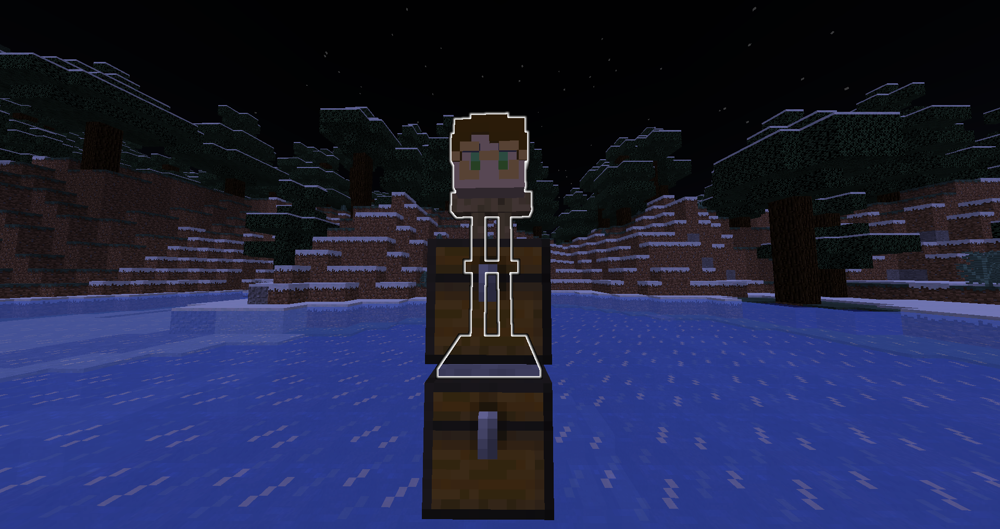

# デスボックス
## 作成目的
思いついたから作りました。死んだときにアイテムをぶちまけずに、回収してくれます。
## 作成環境
ver 1.18.2
前提データパックなし
なお確かめてはいませんが、仕様上1.13~は使える可能性が高いです。
## 導入方法
world/datapacks/にダウンロードしたものを入れる
ワールドを開くか、``/reload``を実行する。
※ただし、設定で``keepInventory``は必ずtrueに変更されます。

上のチェストと下のチェストに格納されます。

